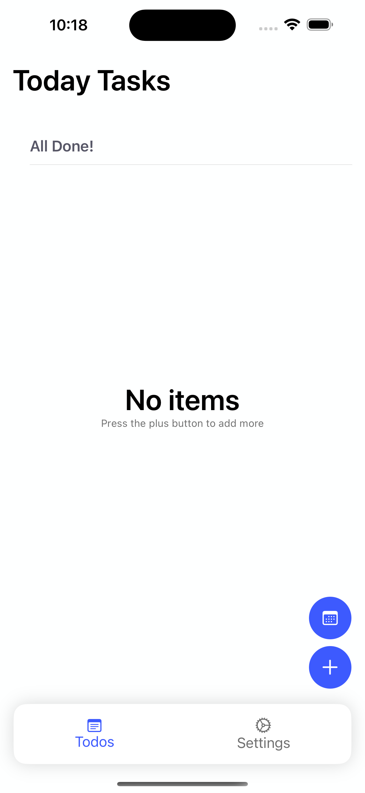
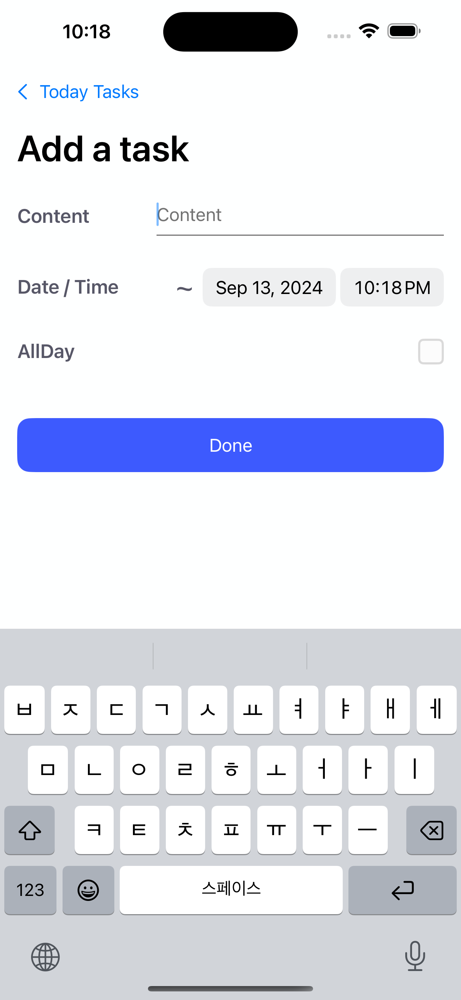
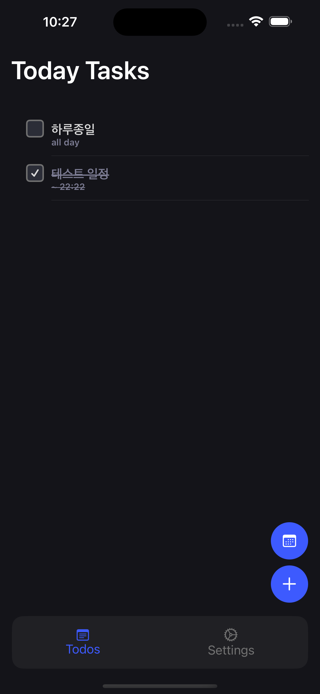

# Doit
일정 관리를 쉽게 할 수 있는 iOS 어플리케이션 입니다.

개인적으로 공부 및 사용 목적으로 개발하였습니다.

## 사용한 기술
- Xcode 15.4
- Swift 5
- SwiftUI + MVVM
- Realm `10.53.0`
- Target Version `iOS 16`

## 스크린샷

## 디자인
- https://www.figma.com/community/file/1150744274711591955/todo-list-for-figma-projects
- https://www.figma.com/community/file/1072981172023301059/todo-app
위 두 디자인을 참고해서 개발하였습니다.

## 남은 기능 목록
- [ ] 설정화면 기능 완성
- [ ] 완료 체크한 예약된 알림 삭제
